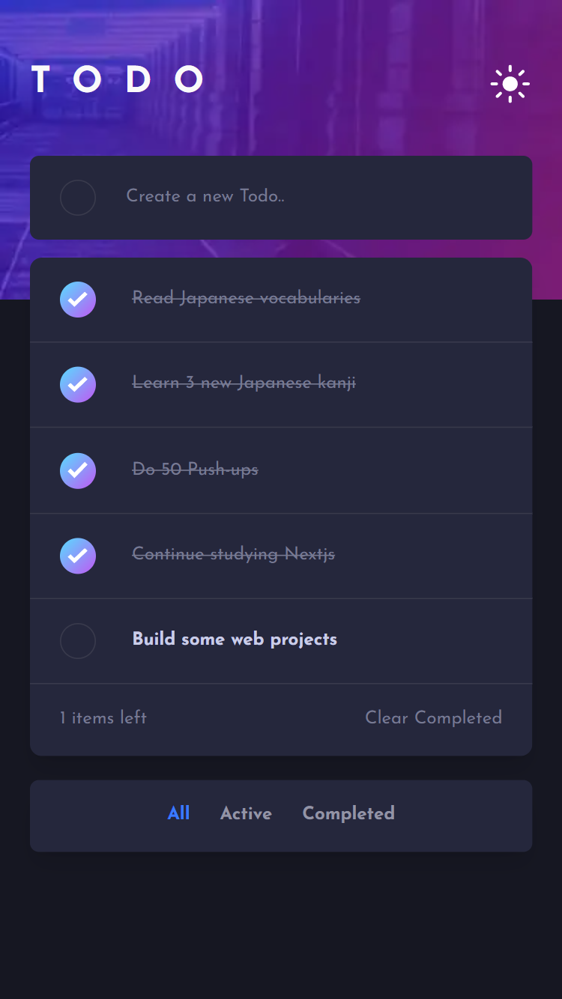
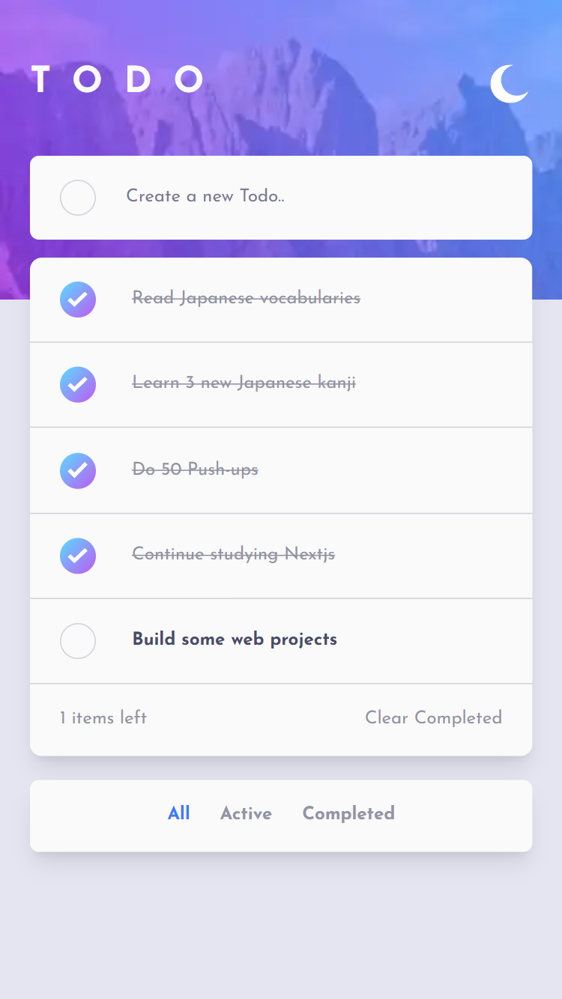
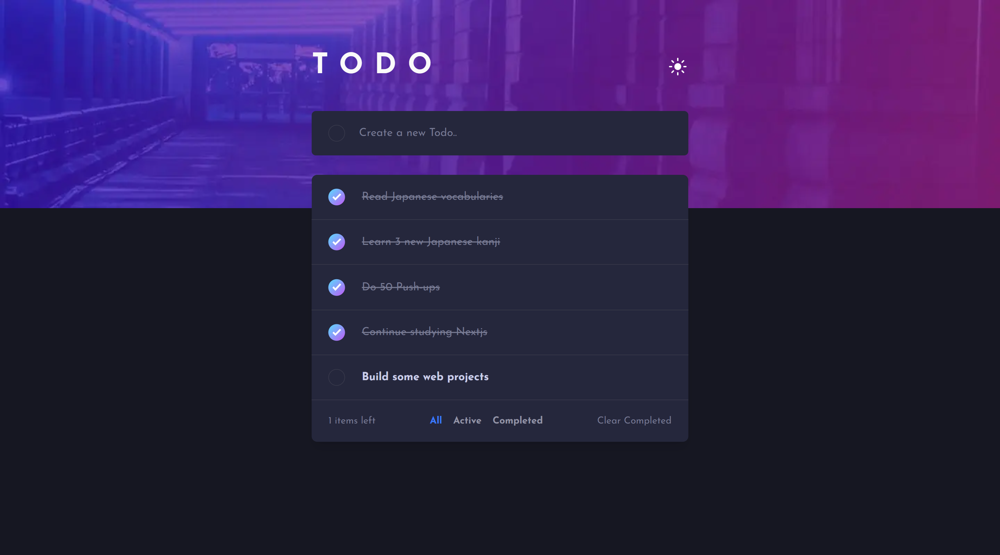
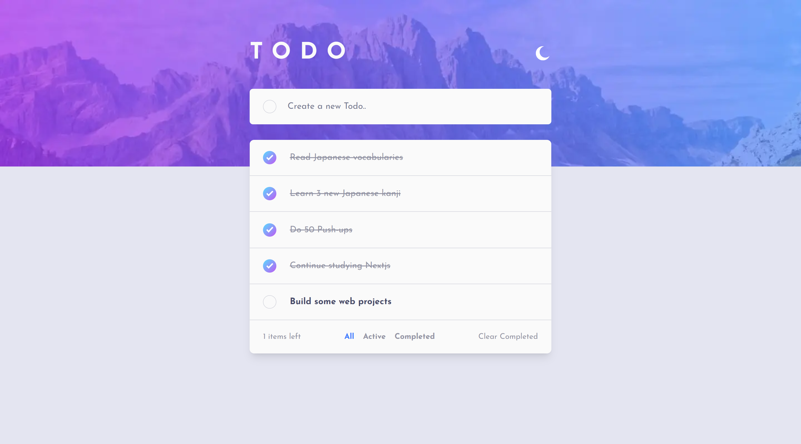

# Frontend Mentor - Todo app solution

This is a solution to the [Todo app challenge on Frontend Mentor](https://www.frontendmentor.io/challenges/todo-app-Su1_KokOW). Frontend Mentor challenges help you improve your coding skills by building realistic projects. 

## Table of contents

- [Overview](#overview)
  - [The challenge](#the-challenge)
  - [Screenshot](#screenshot)
  - [Links](#links)
- [My process](#my-process)
  - [Built with](#built-with)
  - [What I learned](#what-i-learned)
  - [Continued development](#continued-development)

- [Author](#author)


## Overview

### The challenge

Users should be able to:

- View the optimal layout for the app depending on their device's screen size
- See hover states for all interactive elements on the page
- Add new todos to the list
- Mark todos as complete
- Delete todos from the list
- Filter by all/active/complete todos
- Clear all completed todos
- Toggle light and dark mode
- **Bonus**: Drag and drop to reorder items on the list

### Screenshot
1. Mobile view dark mode


2. Mobile view light mode


3. Desktop view dark mode


4. Desktop view light mode


### Links

- Solution URL: [https://github.com/sezaru-dev/todo-app-localstorage](https://github.com/sezaru-dev/todo-app-localstorage)
- Live Site URL: [https://todo-app-cb.vercel.app/](https://todo-app-cb.vercel.app/)

## My process

### Built with

- HTML5
- CSS
- Mobile-first workflow
- next-themes
- [React](https://reactjs.org/) - JS library
- [Next.js](https://nextjs.org/) - React framework
- [TailwindCSS](https://tailwindcss.com/) - CSS Framework


### What I learned


1. Saving data into local storage
```js
localStorage.setItem(LOCAL_STORAGE_KEY, JSON.stringify(newTasks))
```

2. getting data from local storage
```js
localStorage.getItem(LOCAL_STORAGE_KEY)
```

3. Using tailwind and next-themes to change themes from darkmode-lightmode vice-versa.

- tailwind.config.js

```js
/** @type {import('tailwindcss').Config} */
module.exports = {
	darkMode: 'class',
	content: [],
	theme: {
		extend: {},
	},
	plugins: [],
};
```

- index.jsx

```js
  import { useTheme } from "next-themes"

  export default function Home() {
    const { systemTheme, theme, setTheme } = useTheme();
    const [mounted, setMounted] = useState(false);

    useEffect(() => {
      setMounted(true);
    }, []);

    if (!mounted) return null;
    const currentTheme = theme === 'system' ? systemTheme : theme;

    return (
      <h1>Index Page</h1>
    )
  }
```
- toggle dark mode to light mode

```js
  {currentTheme === 'dark' ? (
    <button className=" h-7 w-7" onClick={() => setTheme('light')}>
      <Image src={sunIcon} alt="sun.svg" />
    </button>
  ) : (
    <button className=" h-7 w-7" onClick={() => setTheme('dark')}>
      <Image src={moonIcon} alt="moon.svg" />
    </button>
  )}
```


### Continued development

I tried to use react-beautiful-dnd for drag&Drop functionality and it was a success, but i've decided not to implement drag&drop because I ended up deleting some task when I reorder list on active and completed tabs.


## Author

Frontend Mentor - [sezaru-dev](https://www.frontendmentor.io/profile/sezaru-dev)


